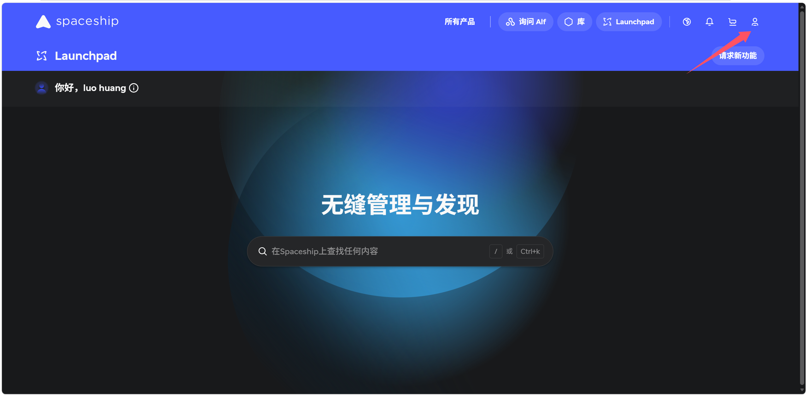

# 为什么选择Spaceship
Spaceship是Namecheap旗下的域名注册平台，经常有新用户优惠，价格比国内大多数平台便宜不少。:mark[.com]域名首年大概20元左右，:mark[.net]域名大概15元左右，部分冷门后缀最低能到6元/年。  
   
对比一下其他平台的价格：阿里云/腾讯云等:mark[.com]首年大概55-69元，续费也不会便宜多少。Spaceship的价格优势明显。

# 注册流程

## 1.注册账户
打开[Spaceship.com](https://www.spaceship.com/)，右上角注册账号，用邮箱注册就好。

## 2.搜索域名
首页搜索框输入你想要的域名，比如:mark[myblog],系统会列出所有可用后缀以及对应的价格。

几个建议：

-优先选择:mark[.com]，认知度最高
-预算有限可以选择:mark[.xyz]、:mark[.site]、:mark[.online]这些，首年基本上很便宜
-域名尽量不要太长，保证简洁好记
-注意看**续费价格**，有限首年很便宜但续费贵

## 3.加入购物车并结算
选好域名后加入购物车，结算时注意：

-**WHOIS隐私保护**：Spaceship默认免费赠送，不用额外花钱
-**取消不必要的附加服务**：默认可能会勾选一些付费服务，按自己需要取消
-支付方式支持信用卡、PayPal、支付宝等

## 4.完成购买
付款成功后，域名会出现在你的控制台。进入Domains Management就能看到域名的管理界面。

# 几个要注意的坑
**续费价格不等于首年价格。**购买之前看一眼续费价格，有些:mark[.xyz]首年6元，续费可能会到60+。
**域名转出有限制。**注册后60天内不能转出，不过不影响正常使用。
**实名认证。**Spaceship是国外平台，不需要国内实名认证流程，但如果后续要绑定国内服务器，则需要完成备案。我们后面搭建博客使用的是Cloudflare，所以不需要备案，流程想对简单。

# 后续步骤
域名注册好后，后面搭建博客会用到。主要是在Cloudflare上把域名解析到博客地址。